# 보장zip - 놓친 보험금 찾기 AI

보장zip은 사용자의 보험 가입 정보와 질병·입원 정보를 바탕으로 청구 가능한 보장을 탐색하고, 약관 원문 근거와 함께 분석 결과를 제공하는 미청구 보험금 탐색 플랫폼입니다.

복잡한 약관과 정보 비대칭 때문에 사용자가 놓치기 쉬운 보장을 AI RAG와 룰 엔진으로 검토해, “청구할 수 있는 보장인지”, “예상 보험금은 얼마인지”, “어떤 약관 문구가 근거인지”를 한 화면에서 확인할 수 있게 만드는 것이 목표입니다.

## 문제의식

보험금은 청구해야만 지급되지만, 실제 사용자는 본인이 가입한 특약과 질병·입원 상황이 어떤 보장에 연결되는지 알기 어렵습니다.

- 실손보험 가입자는 약 3,578만 명이지만 청구하지 못한 보험금이 계속 발생합니다.
- 지급 확정 후에도 찾아가지 않은 숨은 보험금은 약 11.2조 원 규모로 알려져 있습니다.
- 청구권 소멸시효 3년이 지나면 권리 행사가 어려워질 수 있습니다.
- 손실의 원인은 청구 의지 부족보다 복잡한 약관, 보장 조건, 정보 비대칭에 가깝습니다.

보장zip은 이 간극을 줄이기 위해 사용자가 입력한 상황을 약관 데이터와 대조하고, 청구 가능성이 있는 보장을 근거와 함께 제시합니다.

## 핵심 기능

| 기능 | 설명 |
| --- | --- |
| 청구 가능 보장 탐색 | 사용자의 진단명, 입원/통원, 수술, 치료 코드 등을 기반으로 후보 특약을 탐색합니다. |
| 약관 원문 근거 제시 | RAG 검색 결과에서 관련 약관 조항과 페이지 근거를 함께 제공합니다. |
| 룰 기반 최종 판정 | 대기기간, 보장 경계, 청구 조건, 금액 계산 규칙을 순수 함수 룰 엔진으로 검증합니다. |
| 예상 보험금 계산 | 정액 보장과 실손 보장을 구분해 가입금액, 자기부담금, 급여/비급여 정보를 반영합니다. |
| 판정 결과 설명 | LLM을 사용해 분석 결과를 사용자 친화적인 리포트로 정리합니다. |

## 서비스 흐름

서비스는 약관 데이터 구축, 사용자 케이스 생성, 보장 분석, 결과 제공의 네 단계로 동작합니다.

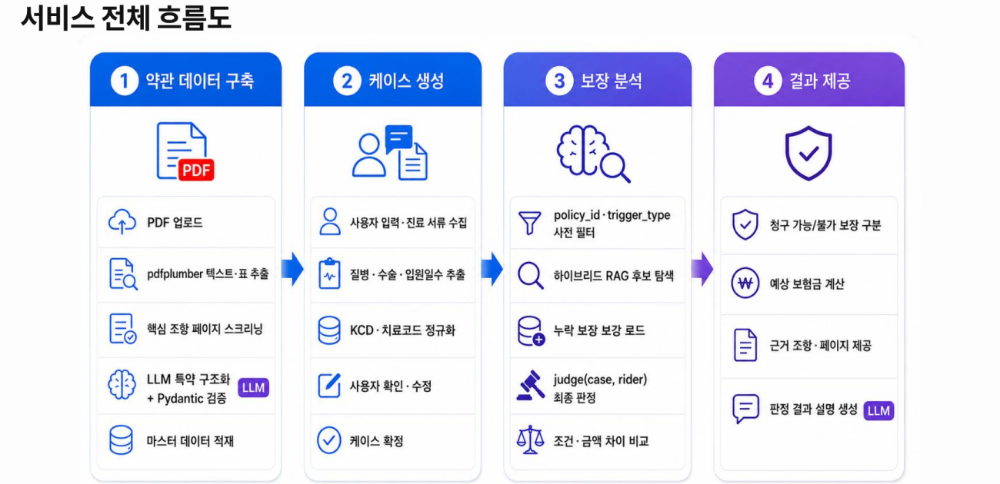

## RAG + 룰 엔진

보장zip은 비정형 약관 문서를 찾는 데 강한 RAG와, 수식·조건 검증에서 오차가 없어야 하는 룰 엔진을 결합합니다.

```text
사용자 상황 입력
    -> RAG 검색으로 관련 약관 조항 탐색
    -> 룰 엔진으로 조건 필터링 및 예상 금액 산출
    -> 근거 조항과 보장 판정 결과 제시
```

- RAG는 약관 chunk, embedding, metadata filter, keyword score를 조합해 관련 조항을 찾습니다.
- 룰 엔진은 `judge(case, rider)` 순수 함수로 유지하며 DB나 LLM에 접근하지 않습니다.
- 판정 우선순위는 `waiting_period -> boundary -> eligible` 순서를 따릅니다.
- 정액 보장은 가입금액 기반으로, 실손 보장은 `claim_rule`과 급여/비급여·자기부담 정보를 기반으로 계산합니다.
- LLM은 판정 자체를 대체하지 않고, 근거 기반 설명과 사용자용 리포트 생성을 담당합니다.

## 검증 방식

판정 정확도는 골든셋 기반으로 검증합니다. 사전에 정의한 테스트 시나리오와 기대 보장을 기준으로 정답 일치 여부, 조건/분류 일치 여부, 수치/범위 일치 여부, 근거 조항 매핑 여부를 자동 비교합니다.

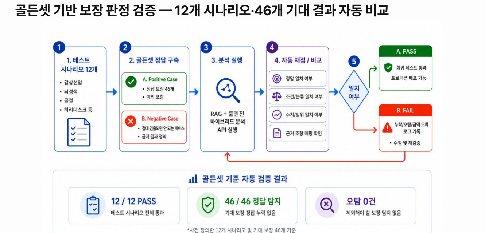

자동 채점 러너는 `scripts/eval_golden.py`를 사용합니다.

## 시스템 아키텍처

```text
사용자
  -> Frontend: React, Vite, Tailwind CSS
  -> Backend: Flask API Server
  -> Database: Supabase Auth, PostgreSQL, Storage, pgvector
  -> AI Services: OpenAI API, Claude API
```

- 프론트엔드는 Vercel 배포를 기준으로 합니다.
- 백엔드는 AWS EC2 배포를 기준으로 합니다.
- Supabase는 인증, 약관/분석 데이터, 파일 저장소, 벡터 검색을 담당합니다.
- GitHub Actions는 프론트엔드 lint/build와 백엔드 ruff/test를 실행합니다.

## 기술 스택

| 영역 | 기술 |
| --- | --- |
| Frontend | React 19, TypeScript, Vite, Tailwind CSS, Axios, React Router, Supabase Auth |
| Backend | Flask, flask-openapi3, Pydantic, Supabase, PostgreSQL, pgvector |
| AI/RAG | OpenAI API, Claude API, embedding, hybrid retrieval, prompt files |
| Infra | GitHub Actions, Vercel, AWS EC2, Supabase |
| Quality | Ruff, Pytest, ESLint, Prettier, golden set evaluation |

## 프로젝트 구조

```text
bojang/
├─ frontend/                 # React + Vite 클라이언트
├─ backend/                  # Flask API 서버
├─ supabase/migrations/      # 도메인별 DB 마이그레이션
├─ data/                     # 약관 원문, 파싱 결과, 검수 데이터
├─ docs/                     # 아키텍처·도메인 규칙 문서
├─ prompts/                  # LLM 프롬프트
├─ scripts/                  # 파싱·검증·평가 스크립트
└─ tests/golden/             # 탐색·판정 정확도 골든셋
```

## 실행 방법

### Frontend

```bash
cd frontend
pnpm install
pnpm dev
```

기본 주소는 `http://localhost:5173`입니다.

### Backend

```bash
cd backend
python -m venv .venv
```

Windows:

```bash
.venv\Scripts\activate
```

Linux / macOS:

```bash
source .venv/bin/activate
```

패키지 설치:

```bash
pip install -r requirements.txt
```

환경변수 설정:

```bash
cp ../.env.example .env
```

서버 실행:

```bash
python app/main.py
```

기본 주소는 `http://localhost:5000`입니다.

API 문서는 백엔드 실행 후 다음 경로에서 확인할 수 있습니다.

- Swagger: `http://localhost:5000/openapi/swagger`
- Redoc: `http://localhost:5000/openapi/redoc`
- OpenAPI JSON: `http://localhost:5000/openapi/openapi.json`

## 주요 명령

### Frontend

```bash
cd frontend
pnpm lint
pnpm build
```

### Backend

```bash
cd backend
ruff check .
pytest
```

### 골든셋 평가

```bash
python scripts/eval_golden.py
```

## 발표자료

PDF를 다운로드하지 않아도 README에서 발표자료를 한 페이지씩 볼 수 있도록 슬라이드를 이미지로 변환해 두었습니다.

<details>
<summary>발표자료 전체 보기</summary>

### 1. 서비스 소개

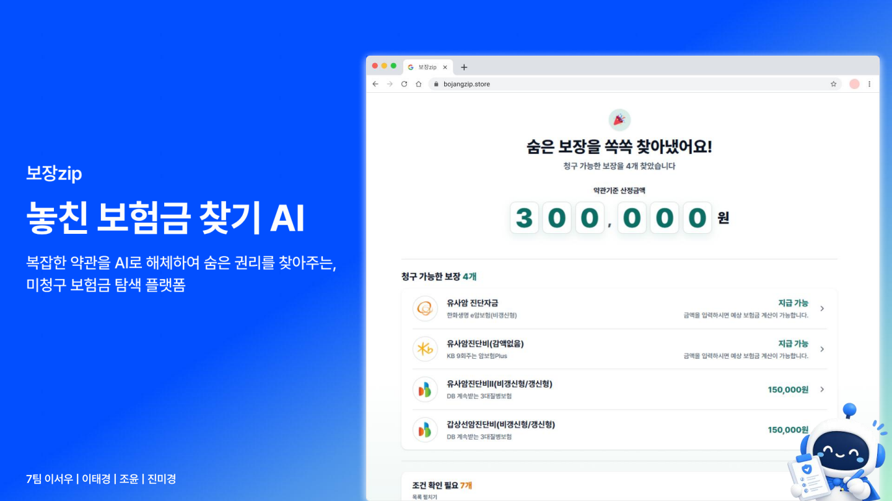

### 2. 소비자가 체감하는 정보의 비대칭

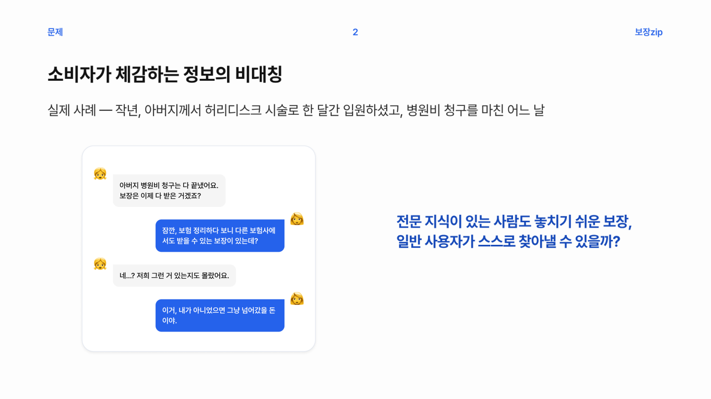

### 3. 제안 배경

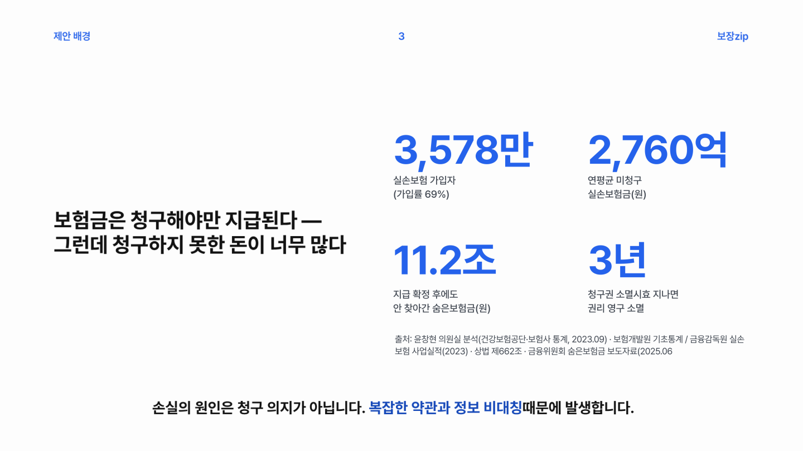

### 4. Pre-Claim 영역 탐색

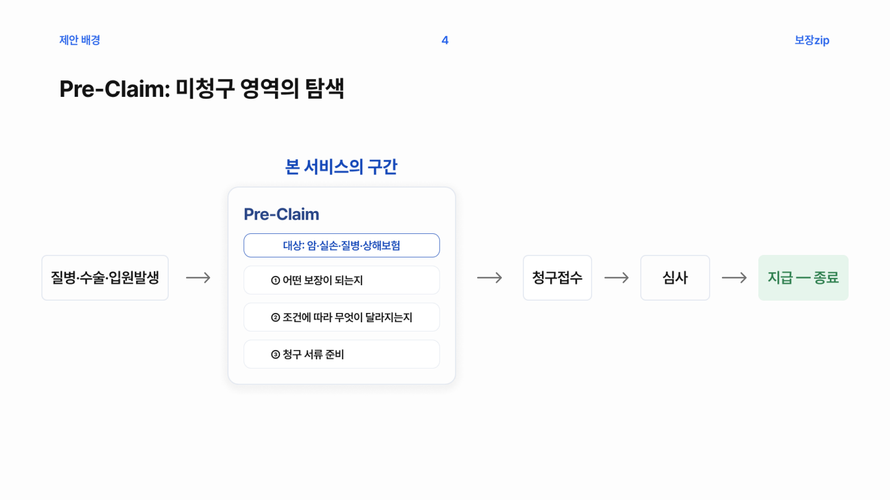

### 5. 기존 서비스와의 차별점

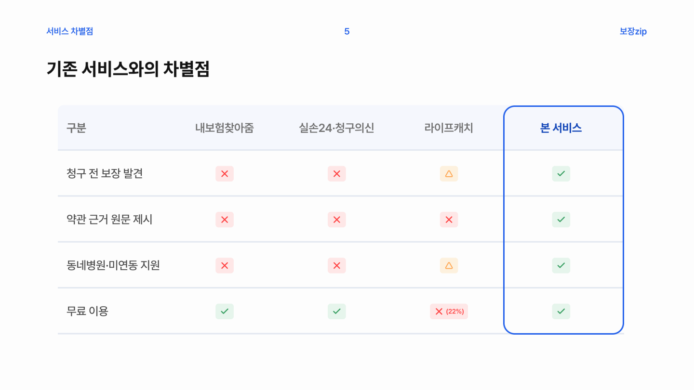

### 6. 서비스 정의

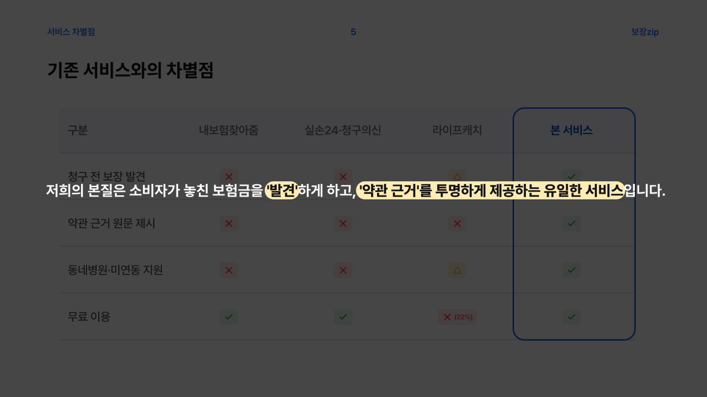

### 7. 서비스 전체 흐름도

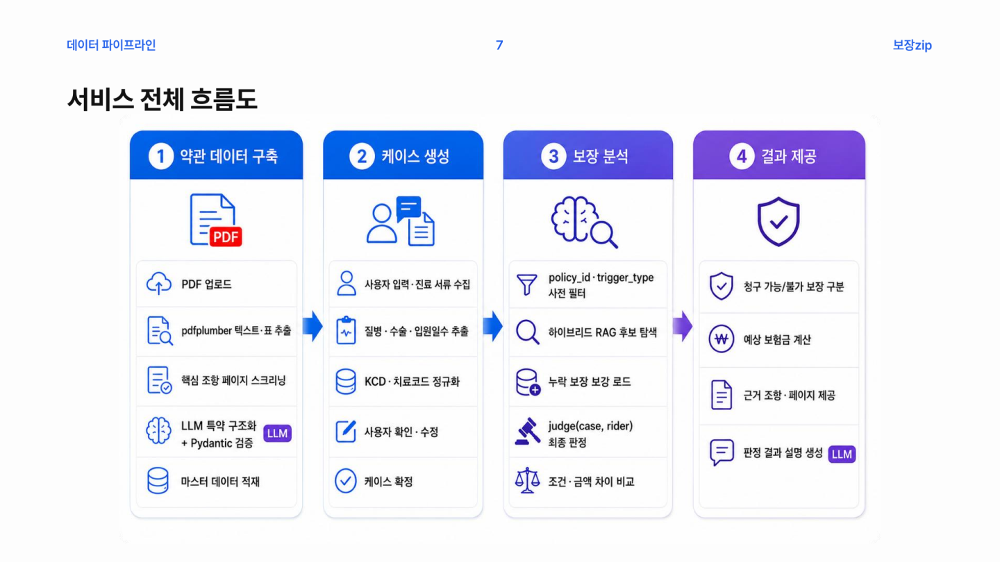

### 8. AI RAG와 룰 엔진의 결합

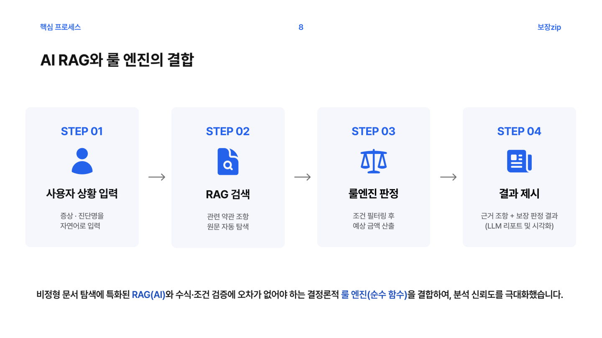

### 9. 진단명 명확 + 통원/입원 불명확

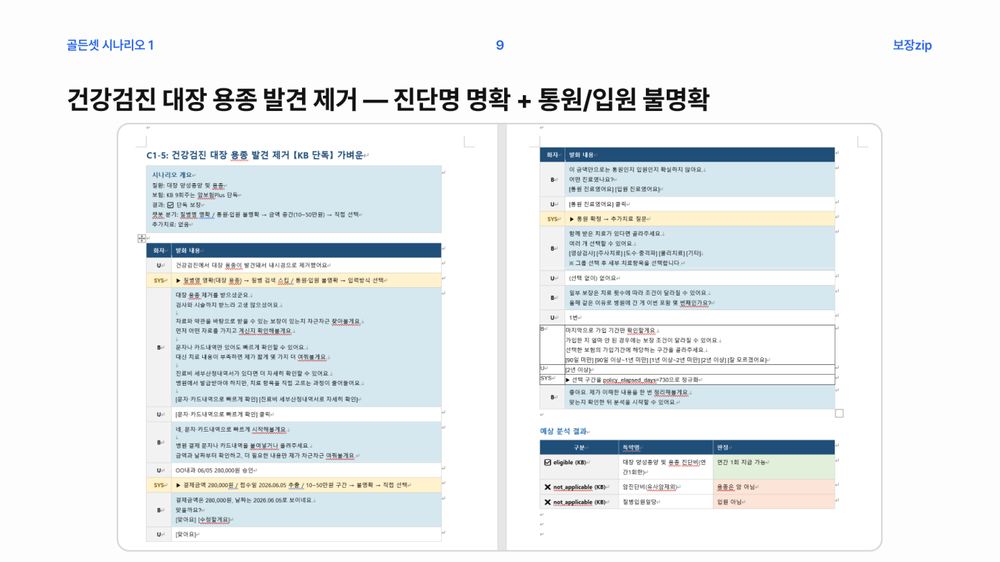

### 10. 진단명 명확 + 통원 명확

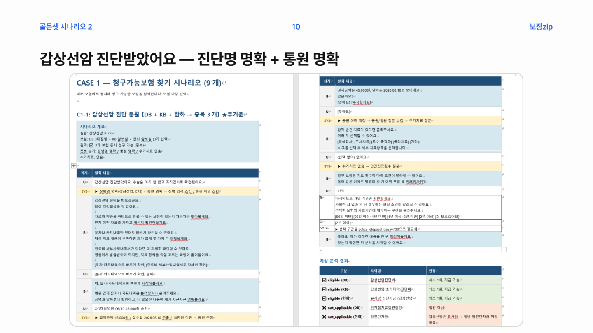

### 11. 급성심근경색 3일 vs 4일 입원

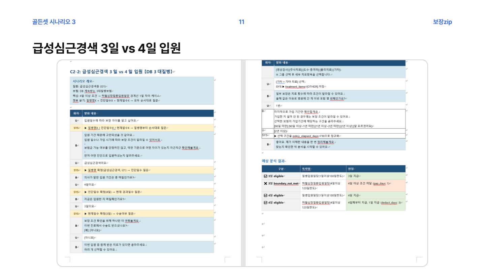

### 12. 골든셋 기반 보장 판정 검증

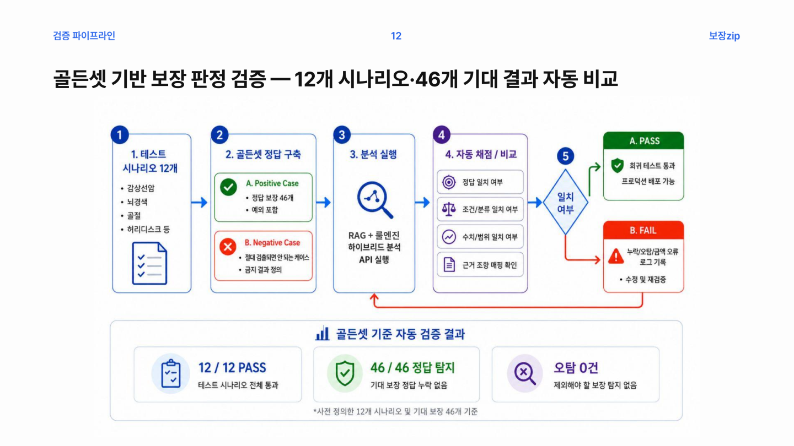

### 13. 시스템 아키텍처

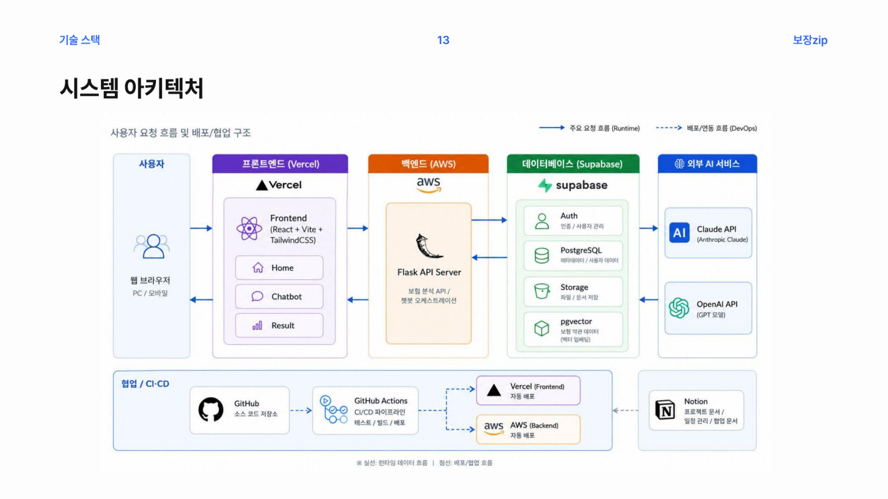

### 14. 서비스 시연

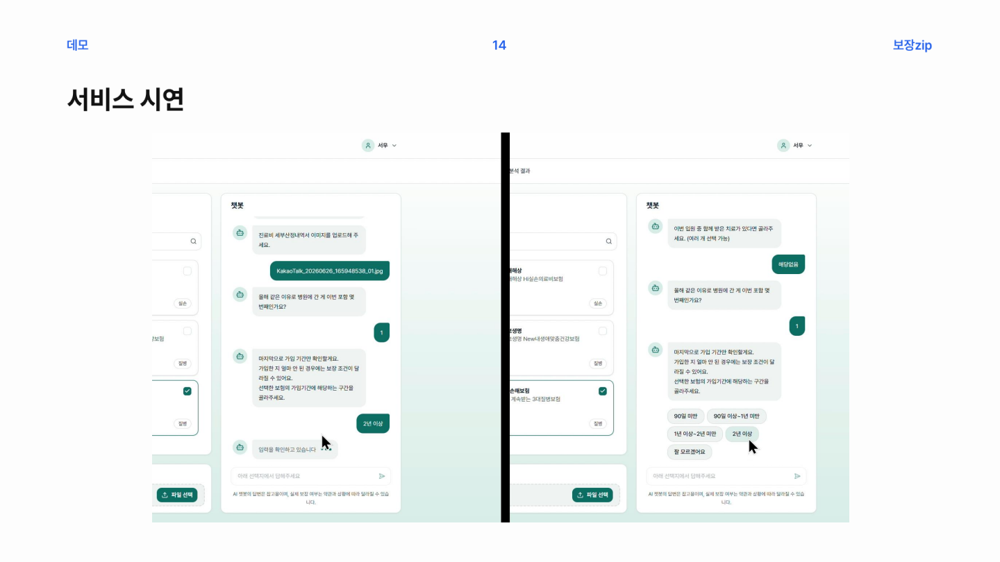

### 15. 기대효과와 향후 확장

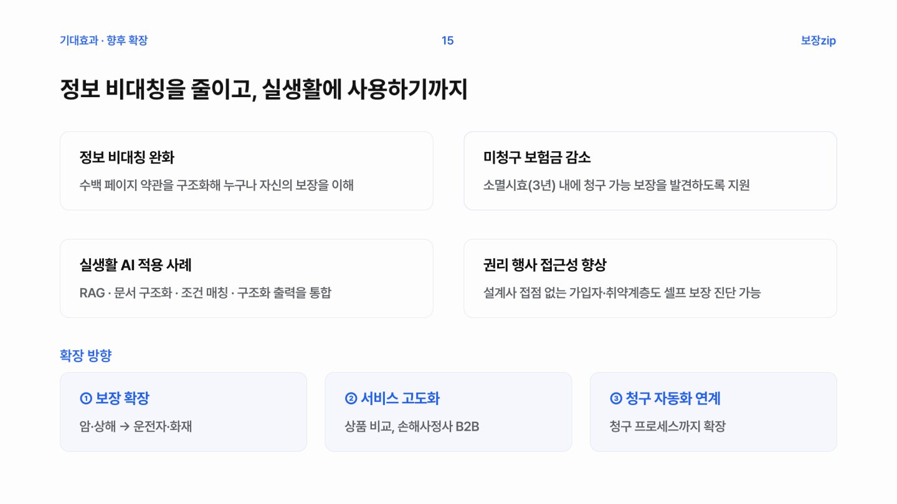

### 16. 팀원 소개


### 17. Q&A

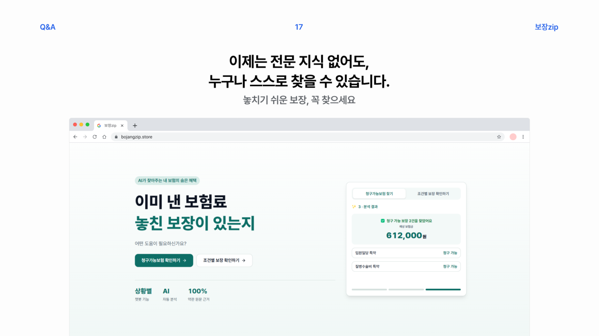

### 18. 룰엔진 판정 상세

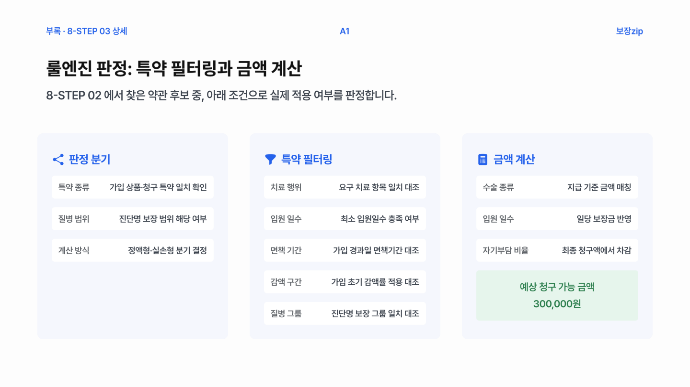

</details>

## 시연 영상

시연 영상은 아래 링크에서 확인할 수 있습니다.

[보장zip 시연 영상 보기](https://drive.google.com/file/d/1Vzg9gZDOhSJDwP7_D78Y4UzwGAuXb__V/view?usp=drive_link)

## 팀

| 이름 | 역할 |
| --- | --- |
| 조윤 | RAG, 데이터 구축, 약관 파싱 |
| 이서우 | 프론트엔드, 백엔드, CI/CD 구축 |
| 이태경 | 룰 엔진, 백엔드 |
| 진미경 | 기획, 백엔드, 서비스 흐름 설계 |

## 개발 규칙

- 프론트엔드 도메인 타입은 백엔드 Pydantic 스키마와 일치해야 합니다.
- 프롬프트 문자열은 코드에 하드코딩하지 않고 `prompts/`에서 로드합니다.
- 약관 원문 PDF와 대용량 파싱 결과는 기본적으로 Git에 커밋하지 않습니다.
- 판정·탐색 변경 시 `tests/golden/`의 정탐과 오탐 기준을 함께 검증합니다.
- 직접 의존성은 `backend/requirements.in`에 추가하고 `pip-compile requirements.in -o requirements.txt`로 잠금파일을 재생성합니다.
